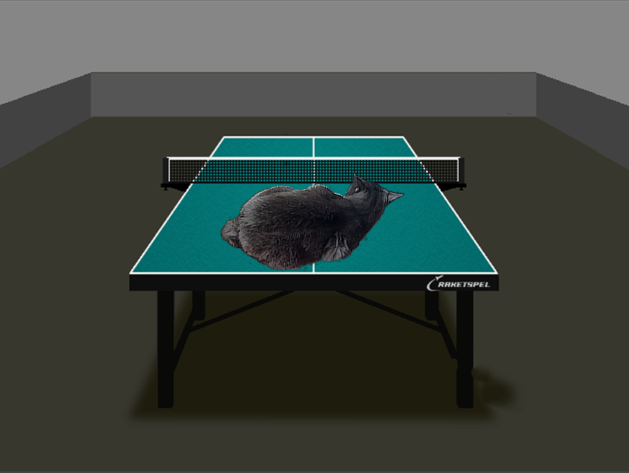

# Optimisation of alpha-blending algorithm

## Introduction
In this work I tried to optimise algorithm of merging pictures by using available on my computer SIMD instructions: SSE and AVX2

## Alpha-Blending algorithm
This algorithm is widely used for merging pictures. There are 2 pictures: back- and foreground, 2nd one should be imposed on the 1st. When 2 pictures of the same size given as arrays of pixels in RGB format, every pixel has 4 components:

``(Red, Green, Blue, Alpha)``

To merge pictures with the same size we use algorithm that takes every pixel of both pictures (arrays ``front`` and ``back``) and calculates pixels of resulting picture (array ``screen``) using simple rool:

``screen_clr = front_clr * front_alpha + back_clr * (1-front_alpha)``, where ``front_alpha`` is normalized alpha coefficent of the front picture pixel

So perfomance of algorithm depends on amount of pixels in resulting picture:

``t ~ width * height``

## Used data
In our case, there are 2 pictures given:

As a result cat have to appear on the table. Resulting picture has the same size as picture with table: ``800*600``, so number of operating pixels in algorithm is ``600*800 = 480000``. It actually takes time to process all of them.

## Optimisation principles
Ideas of optimisation that use SSE and AVX2 instructions are different:

### SSE optimisation:
We are able to process 4 pixels at the same time by using __m128i variables and SSE instructions. Here is mechanism of optimisation described step-by-step:

1) Loading data from Front and Back pixel arrays:
    __m128i front = Front[i]
    __m128i back  = Back[i]

    used commands: ``_mm_load_si128``

2) Splitting pixels data on 2 variables (higher (1,2) and lower (3,4) pixels):
    __m128i front -> __m128i frontH, __m128i frontL
    __m128i back  -> __m128i backtH, __m128i backL

    used commands: ``_mm_movehl_ps``

3) Converting all variables to the format  below for mulling:
    |index|[15]|[14]|[13]|[12]|[11]|[10]|[09]|[08]|[07]|[06]|[05]|[04]|[03]|[02]|[01]|[00]|
    |:----|:--:|:--:|:--:|:--:|:--:|:--:|:--:|:--:|:--:|:--:|:--:|:--:|:--:|:--:|:--:|:--:|
    |value| ri | 00 | gi | 00 | bi | 00 | ai | 00 | rj | 00 | gj | 00 | bj | 00 | aj | 00 |

    used commands: ``_mm_cvtepu8_epi16``

4) Getting alpha parameters in the same format
    |index|[15]|[14]|[13]|[12]|[11]|[10]|[09]|[08]|[07]|[06]|[05]|[04]|[03]|[02]|[01]|[00]|
    |:----|:--:|:--:|:--:|:--:|:--:|:--:|:--:|:--:|:--:|:--:|:--:|:--:|:--:|:--:|:--:|:--:|
    |value| ai | 00 | ai | 00 | ai | 00 | ai | 00 | aj | 00 | aj | 00 | aj | 00 | aj | 00 |

    __m128i frontL -> __m128i alphaL
    __m128i frontH -> __m128i alphaH

    used commands: ``_mm_shuffle_epi8``
    __m128i alpha_shuffle_mask = {128, 14, 128, 14, 128, 14, 128, 14, 128, 6, 128, 6, 128, 6, 128, 6}

5) Mulling front and back colors on alphas
    frontL *= alphaL        , frontH *= alphaH
    backL  *= (255 - alphaL), backH  *= (255 - alphaH)

    used commands: ``_mm_mullo_epi16``, ``_mm_sub_epi16``

6) Summing front and back colors
    __m128i sumL = frontL + backL
    __m128i sumH = frontH + backH

    used commands: ``_mm_add_epi16``

7) Normalizing sums
    sumL = sumL >> 8
    sumH = sumH >> 8

    used commands: ``_mm_shuffle_epi8``
    __m128i sum_shuffle_mask = {128, 128, 128, 128, 128, 128, 128, 128, 15, 13, 11, 9, 7, 5, 3, 1}

8) Storing all 4 result pixels in result var
    sumH, sumL -> __m128i screen

    used commands: ``_mm_movelh_ps``

9) Loading result pixels to the Screen array
    Screen[i] = screen

    used commands: ``_mm_store_si128``

### AVX2 optimisation:
in process...

## Perfomance
To evaluate and compare the speed of working algorithms I calculate fps value of 10 cycles of Alpha-Blending:

``fps = 1 / blending_time``

It's important to evaluate the time correctly, so when I do it, app don't draw anything in SFML, just operates with arrays of pixels

Evaluations made with precision ~ ``0.3 sec^(-1)``

|optimisation \ flag        |None   |-O0 |-O1  |-O2  |-O3      |-Ofast|
|:--------------------------|:-----:|:--:|:---:|:---:|:-------:|:----:|
|no optimisation,   sec^(-1)|**9.9**|9.9 |12.5 |12.9 |12.9     |12.9  |
|speed increase,    sec^(-1)|  1.0  |1.0 |1.3  |1.3  |1.3      |1.3   |
|                           |       |    |     |     |         |      |
|SSE inctructions,  sec^(-1)|9.6    |9.3 |148.3|150.7|**151.2**|150.9 |
|speed increase,    sec^(-1)|1.0    |0.9 |15.0 |15.2 |**15.3** |15.2  |
|                           |       |    |     |     |         |      |
|AVX2 instructions, sec^(-1)|       |    |     |     |         |      |
|speed increase,    sec^(-1)|       |    |     |     |         |      |

## Results

The result of running programm in the DRAW_MODE:

## Conclusion
Thus, optimising alpha-blending alogithm by using SSE instructions, a speedup of **15.3** times was achieved
